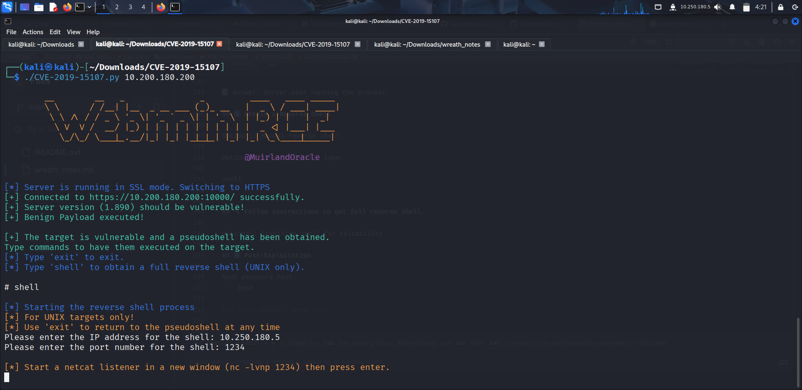

# 🌐 Wreath Walkthrough Notes


Objective: Learn pivoting, Empire C2, basic AV evasion, and beginner pentesting skills.


# Wreath Walkthrough Notes

**Table of Contents:**
- [Task 1: Introduction](#task-1-introduction)
- [Task 2: Accessing the Network](#task-2-accessing-the-network)
- [Task 3: Backstory](#task-3-backstory)
- [Task 4: Brief](#task-4-brief)
- [Task 5: Enumeration](#task-5-enumeration)
- [Task 6: Exploitation](#task-6-exploitation)
- [Task 7: Pivoting](#task-7-pivoting)
- [Task 8: High-Level Overview](#task-8-high-level-overview)
- [Task 9: Enumeration through a Compromised Host](#task-9-enumeration-through-a-compromised-host)


# Task 1: Introduction

### 🛠️ Tools:


Provided zip (password: WreathNetwork)


Recommended: download latest versions during tasks


### 📹 Videos:


DarkStar7471’s YouTube guides linked in each task ▶️


### 📝 Prerequisites:


Basic Linux commands


Fundamental hacking knowledge


Basic coding (Python/PHP)


### ⚡ Key Learning Points:


🔀 Pivoting – Move through network from compromised machines


💻 Empire C2 – Command & Control framework usage


🛡️ AV Evasion – Simple techniques to bypass anti-virus


🐍 Code Analysis – Python & PHP


⚡ Exploits – Find, modify, and test public exploits


🌐 Webapp Testing – Enumeration & basic exploitation


📂 Git Analysis – Explore and understand repo structure


🪟 Windows Post-Exploitation – Simple techniques


🔧 CLI Firewall Admin – CentOS & Windows


⚙️ Cross-Compilation & Wrappers – Create simple programs


📤 Exfiltration – Basic techniques to extract data


📝 Reporting – Format pentest reports properly


### 📌 Conduct:


Respect shared environment 🙏


Upload files/tools as toolname-username


No deleting/changing files or passwords


#### 🚀 Tip: Follow the walkthrough step-by-step, refer to videos if stuck, and practice in sandbox style.


## Task 2: Accessing the Network


###### First, we need to be connected to the network in order to start the Wreath tasks. In a real-world pentest, this could mean having a machine physically or remotely connected to the target network, from which we can begin our attack. For this lab, we download a VPN pack from the TryHackMe Access page under the Network section for Wreath. Then, use openvpn with the .ovpn configuration file to connect. Sometimes, the configuration file may throw errors. If the normal wreath.ovpn file still doesn’t work, download and use wreathv2.ovpn instead, as that is the updated working configuration.Wreath.ovpn didnt work for me


## Task 3: Backstory


###### Out of the blue 📞, your old university friend Thomas Wreath calls after several years. You spend a few minutes catching up 🕰️, laughing over old memories 😄, before he reveals the real reason for the call: he’s set up a few servers at his home 🖥️🏠 for his projects and wonders if you’d like to assess them 🕵️‍♂️. After a moment’s thought 🤔, you decide to accept the challenge — it’s a friend after all. Turning down his offer of payment 💸🚫, you reassure him that you’re happy to help, and the adventure into the Wreath network 🌐 begins.


## Task 4: Brief


###### Thomas has shared details about his home network 🏠: there are three machines in total, including a public-facing webserver 🌐 and a self-hosted Git server 📂 for version control. The webserver is port-forwarded, so that’s likely your entry point 🔑 if a vulnerability can be found. The Git server is internal, meaning it may contain sensitive information 🤫 that Thomas has pushed. Another machine on the network is a Windows PC 🪟 with antivirus installed 🛡️ — likely a server variant, but it cannot be accessed directly from the webserver. This gives you enough information to start exploring! Treat this network like a penetration test 🕵️‍♂️: take extensive notes 📝, capture screenshots 📸, and track any tools or users you create. Writing a full report at the end is good practice for professional work or certifications 🎓. For note-taking, applications like CherryTree or Notion can be useful 🖥️. Before starting, ensure your Kali system is up to date with sudo apt update && sudo apt upgrade 🔄, though this is usually not necessary if using the AttackBox. Let’s get started! 🚀


## Task 5: Enumeration 


### 🔍 Step 1: Port Scan


We start with a port scan on the first 15000 ports.


``` bash

nmap -p 1-15000 -sV -oN initial_scan.txt <TARGET_IP>


```


### 🔍 Step 2: Service Scan on Open Ports


Once we know which ports are open, we perform a deeper scan:


``` bash

nmap -p <OPEN_PORTS_COMMA_SEPARATED> -sV -sC -O -oN service_scan.txt <TARGET_IP>


 ```


-sC → Default scripts


-O → OS detection


### 🌐 Step 3: Web Enumeration


Open the IP in browser:


http://<TARGET_IP>


It attempts to redirect to a domain (but fails because DNS is not set).


### 🛠 Step 4: Fix Hosts File


Manually add domain resolution.


sudo nano /etc/hosts


<TARGET_IP>   example.thm


Save & exit. Now reload http://example.thm.


👉 It resolves, but gives TLS warning. Select Advanced → Accept Risk.


### 📖 Step 5: Footprinting


Read the webpage for information.


### 📡 Step 6: Highest Open Port Enumeration


Look at your Nmap service scan.


### 🛡 Step 7: Vulnerability Research


Google the server version.


You’ll find it is vulnerable to an unauthenticated remote code execution exploit.


✅ At this point, we’ve:


Enumerated ports & services.


Identified OS & domain.


Found sensitive info (phone number).


Discovered a vulnerable service.


Mapped it to a CVE.


## Task 6: Exploitation  


🎯 Objective


Exploit Webmin vulnerability CVE-2019-15107 to gain access to the target server.


Obtain a pseudoshell → reverse shell → post-exploitation.


## 1️⃣ Setup: Clone & Prepare Exploit


Clone the repository:


``` bash

git clone https://github.com/MuirlandOracle/CVE-2019-15107


```


Go to the folder:


``` bash


cd CVE-2019-15107


```


Install required Python libraries:


``` bash


pip3 install -r requirements.txt


```


###### ⚠️ If pip3 not installed:


``` bash

sudo apt install python3-pip


```


###### ⚠️ If the above method didnt work use this


``` bash

python3 -m venv venv && source venv/bin/activate && pip install -r requirements.txt

```

#### After that to deactivate venv


``` bash

deactivate

````


Make script executable (if needed):


``` bash

chmod +x ./CVE-2019-15107.py


```

## 2️⃣ Understand the Script


📌 Always read scripts from unknown sources!


In this lab, the script is safe.


Verify the script executes commands as intended.


## 3️⃣ Run the Exploit


``` bash


./CVE-2019-15107.py TARGET_IP


```




✅ Result: Obtain a pseudoshell on the target.


## 4️⃣ Pseudoshell


Check server user:


whoami


📝 Answer: Server user running the process.


## 5️⃣ Obtain a Reverse Shell


Option 1: Manual reverse shell.


Option 2: In pseudoshell, type:


shell


## 🔧 Follow instructions to get full reverse shell.


Optional: Stabilize shell for reliability.


## 6️⃣ Post-Exploitation


Root password hash:

``` bash


cat /etc/shadow | grep root


```

Persistent access key:


Find file giving root access via other service.


Use:


find / -name "*key*"


Download key to local machine:


chmod 600 KEY_NAME


🔑 Now you have persistent root access.


## 7️⃣ Next Steps


With initial access ✅, the next phase is pivoting to attack other systems in the network.


## TASK 7: PIVOTING 


### Pivoting in Hacking 🕵️‍♂️


### What is Pivoting?

Pivoting means using one computer you’ve hacked to get into other computers in the same network 🔑➡️💻💻💻.


### Why it’s important:


Most internal computers are not on the internet 🌐🚫.


By hacking a public server, you can reach hidden machines inside the network.


### How it works:


Hack a public computer 🌐💻.


Find other computers inside the network 🔍💻💻💻.


Use your access to attack them ⚡.


### Example:


1 public web server (internet-facing) 🌐


3 internal computers (hidden) 💻💻💻


Hack server → pivot → attack internal machines 🔑➡️💻💻💻


#### Remember:


Can do on Linux or Windows 🐧🪟


Firewalls may block some methods 🚧


Practice safely in sandbox networks 🏖️


## TASK 8: High-Level Overview 


### Pivoting Methods 🕵️‍♀️


### 1️⃣ Tunnelling / Proxying 🔗


Creates a channel through a compromised machine to send traffic into the target network.


Traffic can be hidden inside another protocol (like SSH) to avoid firewalls or IDS 🚧👀.


Good for scanning many ports or accessing multiple machines at once 🔍💻💻💻.


### 2️⃣ Port Forwarding 🚪


Connects a local port to a single port on the target via a compromised host.


Faster and more reliable ⚡, but limited to one port or a small range.


#### Tip:


Use Linux/Unix machines for pivoting if possible 🐧.


Outward-facing Linux web servers are ideal 🌐💻.


Common Tools for Pivoting 🛠️


Proxychains / FoxyProxy – redirect traffic


SSH tunnelling / port forwarding – mainly Linux/Unix


plink.exe – Windows


socat – Windows & Unix


chisel – Windows & Unix


sshuttle – Unix only


Q1: Which pivoting method hides traffic inside another protocol?

A: Tunnelling / Proxying 🔗


Q2 (Research): Metasploit command to create port forward?

A: portfwd (in Meterpreter)


## TASK 9: Enumeration through a Compromised Host


### 🛠️ Methods of Enumeration through a Compromised Host


### 📄 Using material on the machine


Example: hosts file, ARP cache, DNS configs.


### 💻 Using pre-installed tools


Linux often has Nmap installed.


### 🗃️ Using statically compiled tools


Self-contained binaries with no extra dependencies.


### 📜 Using scripting techniques


Custom scripts in Bash, Python, PowerShell, etc.


### 🌐 Using local tools through a proxy


Last resort: slow and limited (cannot scan UDP through TCP proxy).


### 🔎 Step 1: Check for Useful Info on Target


#### ARP cache: arp -a – recent IPs.


#### Hosts file:


#### Linux: /etc/hosts


#### Windows: C:\Windows\System32\drivers\etc\hosts


#### DNS info:


#### Linux: /etc/resolv.conf or nmcli dev show


#### Windows: ipconfig /all


⚠️ Misconfigured DNS servers could allow zone transfer attacks.


### 🛠️ Step 2: Pre-installed Tools


Use Living off the Land (LotL) tools first.


Nmap installed? ✅ Scan the network!


### 🗃️ Step 3: Statically Compiled Tools


Dynamic vs Static binary:


Dynamic → needs external libs (.so / .dll).


Static → all dependencies included ✅


Download static Nmap or other tools if needed.


⚠️ Outdated repos may require different syntax.


### 🕵️ Step 4: Scanning Through a Proxy


Slow ⚡, last resort.


TCP only ❌ UDP.


Exception: Nmap Scripting Engine (NSE) can run through proxy after initial discovery.


### 🐧 Step 5: Living Off the Land Shell Techniques

🖥️ Ping Sweep (Linux Bash)


``` bash

for i in {1..255}; do (ping -c 1 192.168.1.${i} | grep "bytes from" &) ; done

```


Loops 192.168.1.1–255


Background pings ⚡


Shows only successful responses ✅


PowerShell equivalent is slow 🐢

Firewalls may block ICMP ❌ Use netcat if needed.


##### 🌐 Port Scanning in Bash


``` bash

for i in {1..65535}; do

  (echo > /dev/tcp/192.168.1.1/$i) >/dev/null 2>&1 && echo $i is open

done

```


Checks all TCP ports 1–65535


Slow, but native 🐚
